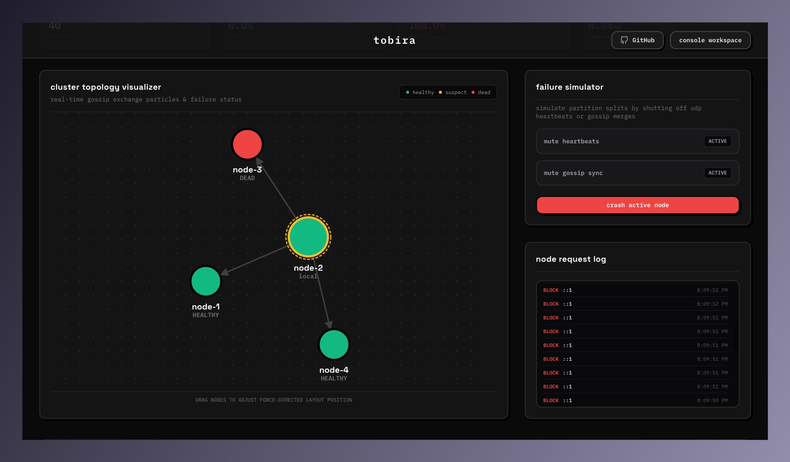
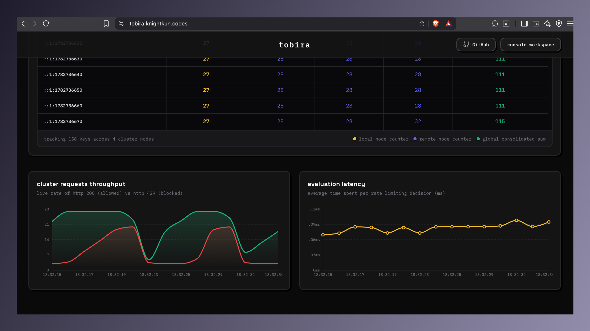
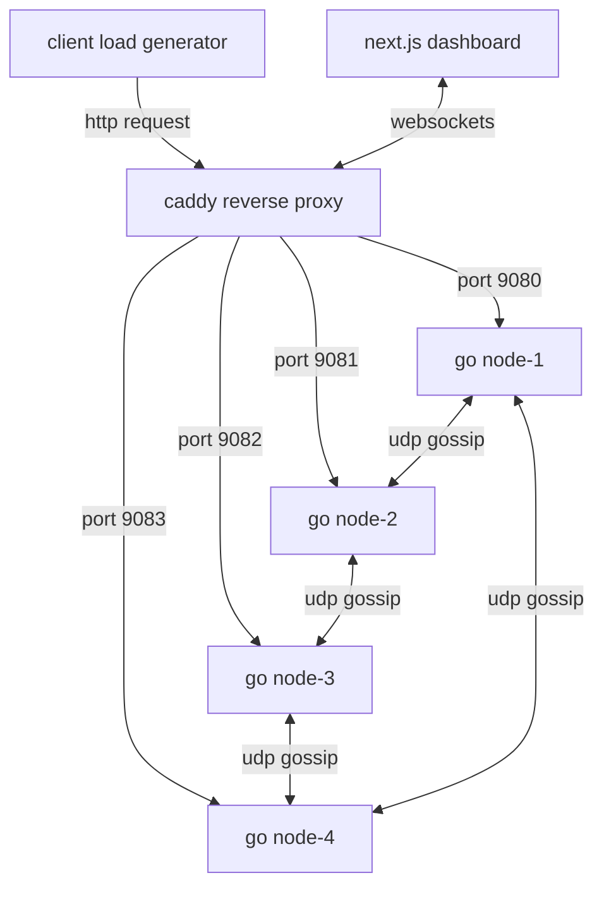

# tobira

[tobira.knightkun.codes](https://tobira.knightkun.codes)

tobira is a high-concurrency, redis-less distributed rate limiter cluster. it synchronizes rate limiting states across independent nodes using a decentralized gossip protocol and visualizes cluster metrics, traffic events, and topology in real time.

---

## visual demo

<p align="center">
  
  
</p>

---

## core features

- **redis-less distributed sync**: no central database or database bottleneck. nodes communicate directly over udp.
- **crdt-based state synchronization**: uses a state-based conflict-free replicated data type (crdt) grow-only counter map per rate-limiting key. states merge deterministically across nodes.
- **pluggable rate limiter algorithms**: 
  - **fixed window**: simple, memory-efficient interval limiters.
  - **token bucket**: supports bursty traffic with continuous token refills.
  - **leaky bucket**: smooths out traffic peaks to maintain constant request output.
  - **sliding window log**: highly accurate frame-based rate limiting.
- **neo-brutalist real-time console**: a next.js-based dashboard displaying live d3 network topologies, state merges, failure simulations, and key request metrics.
- **network partition & failure simulation**: interactive buttons to simulate cluster node crashes, gossip network silences, or custom configurations.

---

## architecture overview



### how gossip & crdts work in tobira

1. **local evaluation**: when an http request arrives at a node (e.g., `node-1`), it increments the local count for the user's key.
2. **vector map representation**: each node stores key counts as a map of maps:
   ```json
   {
     "user_127.0.0.1": {
       "node-1": 15,
       "node-2": 12,
       "node-3": 9,
       "node-4": 11
     }
   }
   ```
3. **udp synchronization**: periodically, each node randomly selects a subset of peers and sends its local state map over udp.
4. **deterministic merge**: when a node receives an incoming map, it updates its local state using a grow-only threshold rule:
   $$\text{count}_{\text{merged}} = \max(\text{count}_{\text{local}}, \text{count}_{\text{incoming}})$$
5. **global limit check**: the sum of counts across all nodes forms the global limit comparison. if the sum exceeds the configured limit, the request is throttled (status `429`).

---

## folder structure

```text
├── Caddyfile              # caddy reverse proxy routing for single-port deploys
├── Dockerfile             # multi-process deploy container for railway
├── README.md              # this project documentation
├── cmd/
│   ├── load/              # concurrent load generator binary source
│   └── server/            # go server entrypoint source
├── config/                # cluster node configurations
├── internal/
│   ├── api/               # http/websocket endpoints and admin control router
│   ├── gossip/            # gossip protocol, transport, and crdt merges
│   ├── limiter/           # token bucket, leaky bucket, sliding, & fixed algorithms
│   └── metrics/           # latency, allowed, and blocked request stats
├── scripts/               # local demo and cleanup automation scripts
├── start.sh               # container startup entrypoint script
└── web/                   # next.js interactive console dashboard app
```

---

## local development

### requirements

- **go** (version 1.26.1 or higher)
- **node.js** (version 20.x or higher)
- **docker & docker compose**

### fast cluster demo

to launch the entire 4-node cluster, a background load generator, and the visual dashboard automatically:

```bash
sh scripts/demo.sh
```

once the initialization scripts complete, visit the dashboard console:
- web dashboard: [http://localhost:3000](http://localhost:3000)

### manual startup

#### 1. run the go cluster nodes manually:
```bash
# terminal 1
go run cmd/server/main.go -id node-1 -port 9080 -peers localhost:9081,localhost:9082,localhost:9083

# terminal 2
go run cmd/server/main.go -id node-2 -port 9081 -peers localhost:9080,localhost:9082,localhost:9083

# terminal 3
go run cmd/server/main.go -id node-3 -port 9082 -peers localhost:9080,localhost:9081,localhost:9083

# terminal 4
go run cmd/server/main.go -id node-4 -port 9083 -peers localhost:9080,localhost:9081,localhost:9082
```

#### 2. run the load generator:
```bash
go run cmd/load/main.go -targets=http://localhost:9080/api/resource,http://localhost:9081/api/resource -rps=30 -workers=4 -duration=300
```

#### 3. run the next.js dashboard:
```bash
cd web
npm install
npm run dev
```

---

## production deployment

tobira is configured for single-process container orchestration using a multi-stage `Dockerfile` and a **caddy reverse proxy**. this enables seamless deployment to platform-as-a-service providers like **railway**.

### docker deployment layout

- **caddy** runs on the container's public `$PORT`, mapping paths dynamically:
  - `/api/proxy/9080*` $\rightarrow$ `localhost:9080` (node 1 backend)
  - `/api/proxy/9081*` $\rightarrow$ `localhost:9081` (node 2 backend)
  - `/api/proxy/9082*` $\rightarrow$ `localhost:9082` (node 3 backend)
  - `/api/proxy/9083*` $\rightarrow$ `localhost:9083` (node 4 backend)
  - `/*` $\rightarrow$ `localhost:3000` (next.js static frontend)
- the backend nodes exchange metrics and state merges via loopback communication to prevent external latency.
